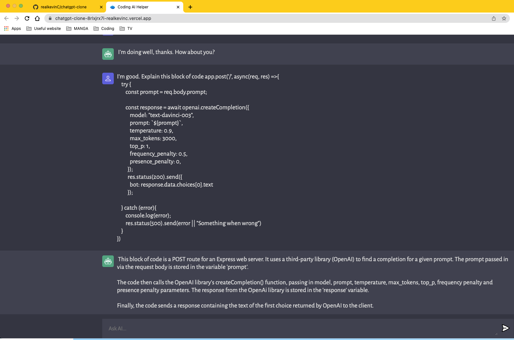

# ChatGPT clone
  https://chatgpt-clone-8rlxjrx7i-realkevinc.vercel.app/

## Description

This is a ChatGPT clone that fetch API data from OpenAi. With this web app you can ask ChatGPT AI questions and it will provide a response. ChatGPT can help regarding JavaScript, React, or any other programming language, giving it code and translating it to another programming language, and much more. ChatGPT is one of the most powerful machine learning chatbot.

## Table of Contents

- [Installation](#installation)
- [Usage](#usage)
- [License](#license)
- [Contribute](#contribute)
- [Tests](#tests)
- [Technology Used](#technology-used)
- [Questions](#questions)

## Installation

To install this application, clone the code into your terminal for the respective repository. Then, install the package by entering the command npm i into the terminal and run: npm run dev on the client folder. Also need to npm run server on the on the server folder to connect client and server. To run local server replace with 'http://localhost:3000/'

## Usage

Install npm and dependencies: npm i.
Run npm run dev on your terminal ( cd to the correct directory).
Run npm run server on your terminal ( cd to the correct directory).

Type in any question in the textbox and Chatgpt will answer it for you.

 

## License

This application uses the MIT License.

Copyright (c) 2023 Kevin Chen

Permission is hereby granted, free of charge, to any person obtaining a copy
of this software and associated documentation files (the "Software"), to deal
in the Software without restriction, including without limitation the rights
to use, copy, modify, merge, publish, distribute, sublicense, and/or sell
copies of the Software, and to permit persons to whom the Software is
furnished to do so, subject to the following conditions:

The above copyright notice and this permission notice shall be included in all
copies or substantial portions of the Software.

THE SOFTWARE IS PROVIDED "AS IS", WITHOUT WARRANTY OF ANY KIND, EXPRESS OR
IMPLIED, INCLUDING BUT NOT LIMITED TO THE WARRANTIES OF MERCHANTABILITY,
FITNESS FOR A PARTICULAR PURPOSE AND NONINFRINGEMENT. IN NO EVENT SHALL THE
AUTHORS OR COPYRIGHT HOLDERS BE LIABLE FOR ANY CLAIM, DAMAGES OR OTHER
LIABILITY, WHETHER IN AN ACTION OF CONTRACT, TORT OR OTHERWISE, ARISING FROM,
OUT OF OR IN CONNECTION WITH THE SOFTWARE OR THE USE OR OTHER DEALINGS IN THE
SOFTWARE.

## Contribute

To contribute clone this repo locally and commit your code on a separate branch. You can also fork the repo and make your pull requests with suggested improvements.

## Tests

To test the app visit: https://chatgpt-clone-8rlxjrx7i-realkevinc.vercel.app/

It can also be tested by entering at command prompt:

npm install (ensure all that dependencies are installed)

npm init

npm run dev ( cd to the correct directory)

npm run server on your terminal ( cd to the correct directory)

## Technologies Used

This application used Vite to setup vanilla JS as the frontend framework, CSS to design responsive layout, Node.js for server side API call, ChatGPT from OpenAi, and deployed server through Render and Vercel on the client side.
